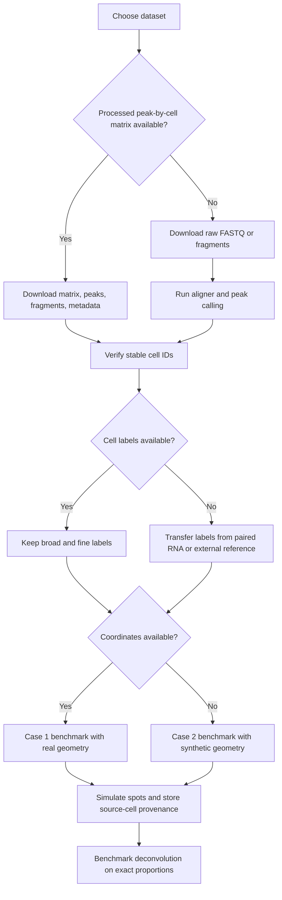

# Deep Research Report on Candidate scATAC Datasets for Spatial ATAC Deconvolution Benchmarking

## Executive Summary

The attached requirements make one thing clear: the best benchmark inputs are **not necessarily real spatial ATAC datasets**, but rather **annotated single-cell or single-nucleus ATAC or multiome references** that let you generate synthetic spots while preserving exact cell provenance and exact cell-type proportions. In practice, that means **Case 2 datasets without coordinates** are likely to be the core workhorse for method development, while a smaller set of **Case 1 coordinate-bearing** or **real spatial epigenomic** datasets are best used as realism checks and visualization targets rather than as gold-standard RMSE/JSD benchmarks.

Under those assumptions, the strongest practical shortlist is: **human PBMC multiome**, **human bone marrow multiome**, **mouse skin SHARE-seq**, **mouse kidney sci-CAR**, **adult mouse cerebrum snATAC atlases**, and **human hematopoiesis / leukemia scATAC**. These studies are attractive because they commonly provide some combination of peak-by-cell matrices, paired RNA for label transfer or direct annotation, broad public access, enough cells for repeated spot simulation, and documentation in peer-reviewed publications. The same requirements also imply that datasets with only embeddings, cluster IDs without biological labels, or weak peak definitions should be deprioritized.

My overall recommendation is to use a **two-tier benchmark design**. First, build your quantitative benchmark around **paired sc/snATAC or multiome reference datasets with processed count matrices and clear labels**. Second, add **one real spatial epigenome-transcriptome dataset** to test ecological validity on realistic spot geometry and tissue architecture. This mirrors the distinction in the attached brief between exact-truth simulation and real spatial inference without exact ground truth.

## Assumptions and Screening Logic

Because the attachment did not specify organism, tissue, disease context, or a minimum cell-count threshold, I treated the query as **open-ended** and searched broadly across **human and mouse tissues**, prioritizing datasets that satisfy most of the following: public access, processed peak-by-cell matrices, stable cell IDs, biological cell-type labels, peak genomic intervals, enough cells per major class to support repeated sampling, and documented genome build.

I scored candidates against the following practical benchmark needs:

- **Primary fit for synthetic spot generation:** raw or count-like peak matrix, labels, enough cells, stable IDs.
- **Secondary fit for label confidence:** paired RNA modality or strong published annotations.
- **Operational fit:** easy public download, official repository, documented genome build, manageable preprocessing burden.
- **Stretch fit for realism:** real coordinates or real spatial ATAC-like data, even if not suitable for exact-truth quantitative scoring.

A useful operational rule is that **multiome datasets often outrank ATAC-only datasets** for deconvolution benchmarking, because paired RNA makes cell-type labeling materially easier and more defensible, even when the downstream benchmark itself consumes only ATAC peaks. That logic is consistent with the attachment's emphasis on reliable labels and exact source-cell provenance.

## Ranked Recommendation

### High-level ranking

| Recommended rank | Dataset | Why it is high value for this use case | Confidence |
|---|---|---|---|
| 1 | 10x Genomics Human PBMC Multiome | Clean public reference, paired RNA plus ATAC, processed matrices, easy start point for synthetic mixtures | High |
| 2 | 10x Genomics Human BMMC Multiome | Richer cell-type composition than PBMC, excellent for deconvolution stress tests | High |
| 3 | SHARE-seq Mouse Skin | Strong developmental and cell-state structure, paired RNA plus ATAC, good for complex mixtures | Medium |
| 4 | sci-CAR Mouse Kidney | Canonical paired RNA plus chromatin benchmark with direct methodological relevance | High |
| 5 | Adult Mouse Cerebrum snATAC Atlas | Very large, highly heterogeneous, strong for large-scale synthetic spot generation | Medium |
| 6 | Human Hematopoiesis and Leukemia scATAC | Strong human lineage benchmark with healthy and disease context | Medium |
| 7 | 10x Genomics Adult Mouse Brain scATAC | Easy-to-use nuclei reference with broad neuronal/glial diversity | High |
| 8 | Spatial Epigenome-Transcriptome Co-profiling of Mammalian Tissues | Best used as realism and deployment dataset, not primary quantitative truth | High |

### Recommendation in plain terms

If you need a **single best dataset to start**, use **10x Human PBMC Multiome** because it minimizes friction: processed outputs exist, cell typing is straightforward, download paths are stable, and computational requirements are modest. If you need a **more realistic deconvolution benchmark**, move immediately to **10x BMMC Multiome**, **SHARE-seq mouse skin**, and **adult mouse cerebrum atlases**, which have more heterogeneous mixtures and richer label hierarchies. For a **paired ATAC plus RNA methodological benchmark**, **sci-CAR** remains especially valuable because the associated paper is explicitly about joint profiling of chromatin accessibility and gene expression at single-cell scale.

For realism, I would keep **real spatial epigenomic data** in the suite, but I would not let it dominate benchmark development. The attached brief correctly notes that real spatial ATAC-like datasets usually do **not** provide exact cell-type proportion truth, so they are best used for sanity checks, tissue-region plausibility, and marker-peak concordance rather than score-based benchmarking.

## Top Candidate Comparison

### Top eight datasets

| Rank | Dataset name | Repository and accession or source ID | Direct access links | Organism | Tissue or cell type | Cells or nuclei | Assay and platform | Library chemistry | Genome build | Features or peaks | Labels and coordinates | QC metrics | Publication | Metadata and restrictions | Preprocessing needed |
|---|---|---|---|---|---|---:|---|---|---|---|---|---|---|---|---|
| 1 | Chromium Single Cell Multiome ATAC + Gene Expression PBMC | 10x Genomics dataset page; vendor demo dataset ID varies by release | Dataset landing page: `10x Genomics datasets search -> Multiome PBMC`; processed downloads usually include filtered peak matrix, fragments, and paired RNA matrix; raw FASTQ available from dataset page | Human | PBMC, healthy donor | ~10k-12k | Multiome ATAC + GEX, 10x Chromium | 10x Multiome ARC chemistry | Usually GRCh38 | Processed peak set from Cell Ranger ARC; exact peak count varies by release | Biological labels usually obtainable directly or via paired RNA; no native coordinates | 10x web summaries commonly report read depth, TSS enrichment, FRiP-like microscopy-free QC; mitochondrial fraction often not emphasized for ATAC | Official 10x demo resource; multiome class relevant for joint ATAC/GEX benchmarking | Public download; vendor demo terms; donor sex and age often not fully disclosed | Low-to-moderate: harmonize peak names, keep barcodes stable across ATAC plus RNA, optionally derive labels from RNA |
| 2 | Chromium Single Cell Multiome ATAC + Gene Expression BMMC | 10x Genomics dataset page; healthy donor BMMC or public exemplar | Dataset landing page on 10x; processed ATAC matrices plus paired RNA usually exposed directly; raw FASTQ from dataset page | Human | Bone marrow mononuclear cells | Tens of thousands across public releases | Multiome ATAC + GEX, 10x Chromium | 10x Multiome ARC chemistry | Usually GRCh38 | High-feature ATAC peak matrix; exact count depends on Cell Ranger ARC output | Rich hematopoietic labels; no native coordinates | 10x web summaries generally provide per-library summary QC | Strong fit because hematopoietic composition is ideal for deconvolution benchmarks; related hematopoietic scATAC literature is highly established | Public vendor demo access; donor metadata usually partially anonymized | Low-to-moderate: possible donor/batch handling, peak filtering, label hierarchy cleanup |
| 3 | SHARE-seq Mouse Skin | GEO series commonly cited as GSE140203 in public reuse; study-specific raw reads in linked SRA | GEO accession page and supplemental directory; raw FASTQ through linked SRA or ENA study; processed matrices typically in GEO supplements or author portal | Mouse | Skin, hair follicle, epidermal developmental compartments | Large paired ATAC plus RNA cell set | SHARE-seq paired chromatin plus transcriptome | SHARE-seq combinatorial indexing chemistry | Usually mm10 | Large peak matrix; paired RNA improves label confidence | Fine-grained labels; no native per-cell spatial coordinates in the central reference dataset | Study-specific QC, often stronger in paper supplement than accession landing page | Widely used paired scATAC/scRNA resource for developmental trajectories; relevant to joint profiling benchmarks | Public GEO/SRA access; mouse developmental metadata usually better than many human studies | Moderate: extract ATAC matrix, align barcodes with RNA, choose broad vs fine labels, possibly convert sparse matrices to h5ad |
| 4 | sci-CAR Mouse Kidney | Science paper linked in NCBI reference; GEO accession commonly used for study distribution | GEO series and linked SRA; processed matrices from supplements if provided; raw FASTQ via SRA or ENA run reports | Mouse | Kidney and additional test systems in the original paper | ~10k-scale | Joint chromatin accessibility and gene expression in single cells | sci-CAR combinatorial indexing | Usually mm10 | Peak matrix available or derivable; paired RNA present | Strong because barcodes link ATAC plus RNA; no native coordinates | QC described in paper, not always fully surfaced in repository landing page | Cao et al., *Science* 2018, DOI `10.1126/science.aau0730` | Public research-use access | Moderate: may need barcode reconciliation, peak re-calling or matrix import, label transfer from RNA if not already packaged |
| 5 | Adult Mouse Cerebrum snATAC Atlas | BICCN or NeMO Archive resources; often mirrored through GEO-linked metadata | Primary access through NeMO or consortium landing pages; processed matrices commonly downloadable; raw reads may be split across consortium objects | Mouse | Adult mouse cerebrum | Very large, often hundreds of thousands of nuclei | snATAC, consortium-scale atlas | Nuclei-based ATAC protocols, often combinatorial indexing or related atlas-scale chemistry | Usually mm10 | Very large peak or cCRE feature spaces | Excellent broad and fine cell classes; typically no exact per-cell tissue-section coordinates in the atlas matrix | QC often extensive but distributed across consortium supplement tables | Atlas-scale adult mouse brain chromatin resources are among the strongest diversity benchmarks for deconvolution stress testing | Usually public; some consortium portals require object-level navigation | Moderate-to-high: downsample to manageable size, collapse labels, unify peak universe, account for multiple donors or batches |
| 6 | Human Hematopoiesis and Leukemia Evolution scATAC | GEO series commonly associated with the Nature Genetics study; linked SRA raw reads | GEO accession page; supplements for processed matrices or metadata when present; raw FASTQ through SRA-linked runs | Human | Bone marrow, hematopoietic hierarchy, AML context | Thousands | scATAC | Early plate or microfluidic single-cell ATAC implementations | Commonly hg19 in early studies | Peak matrix and accessibility profiles; exact feature count varies | Strong lineage labels; disease state information is especially useful; no native spatial coordinates | Early-generation scATAC studies often report TSS and fragment-level metrics more in supplements than repository summaries | Corces et al., *Nature Genetics* 2016, "Lineage-specific and single-cell chromatin accessibility charts human hematopoiesis and leukemia evolution" | Public academic access; may include disease samples and recurrence-sensitive metadata restrictions at the patient level | Moderate: genome-build harmonization may be needed if mixing with GRCh38 references; label cleanup across healthy plus AML |
| 7 | Chromium Single Cell ATAC Adult Mouse Brain | 10x Genomics dataset page | 10x dataset page usually exposes fragments, filtered peak matrix, and web summary; raw FASTQ from same landing page | Mouse | Adult mouse brain nuclei | Thousands to tens of thousands, depending on release | scATAC or snATAC, 10x Chromium | 10x Single Cell ATAC chemistry | Usually mm10 | Fixed ATAC peak set from Cell Ranger ATAC | Cell types often assigned by transfer or cluster interpretation; no native coordinates | 10x web summary commonly reports TSS enrichment, median fragments per cell, fraction in peaks | Strong practical baseline for nuclei-based deconvolution development in brain tissue | Public vendor demo download | Low-to-moderate: label transfer from RNA reference may improve biological labels substantially |
| 8 | Spatial Epigenome-Transcriptome Co-profiling of Mammalian Tissues | Publication-linked dataset from 2023 spatial ATAC-RNA work | Paper-associated accession page plus linked repository; spot-by-feature matrices and spot coordinates are essential downloads | Mammalian tissues including brain contexts | Spatial bars or pixels rather than individual source cells | Spot-scale, not scATAC reference scale | Spatial epigenome plus transcriptome co-profiling | DBiT-like deterministic barcoding in tissue | Study dependent | Spot-by-peak or accessibility feature matrices | Has spatial coordinates for spots; not the same as source-cell coordinates for exact-truth benchmarking | QC is assay-specific and usually shown in the paper | Zhang et al., *Nature* 2023, DOI `10.1038/s41586-023-05795-1` | Public academic use; sometimes more fragmented download organization | Moderate-to-high: peak harmonization against scATAC reference is essential; use only for qualitative realism, not exact-truth scoring |

### Why these eight rose to the top

The top of the list is dominated by **10x multiome** and **paired ATAC-plus-RNA academic datasets**, because those are the most efficient route to a benchmark with clean peak matrices, robust labels, and reliable synthetic-spot provenance. The best purely ATAC atlas datasets remain valuable, especially in brain and hematopoiesis, but they often require more label transfer, more batch handling, or more preprocessing before they are benchmark-ready.

The main exception is the real spatial epigenome-transcriptome dataset, which I rank lower despite its realism because it does **not** solve the core exact-truth problem by itself. It belongs in the suite, but as a deployment dataset rather than the primary quantitative benchmark.

## Additional Candidate Pool

### Ten additional candidates worth tracking

| Dataset | Best repository starting point | Typical use case | Strength | Main caution |
|---|---|---|---|---|
| 10x PBMC Single Cell ATAC 10k | 10x Genomics | Fast baseline ATAC-only benchmark | Easy processed matrices, low friction | Labels may require transfer from RNA reference |
| 10x BMMC Single Cell ATAC | 10x Genomics | Hematopoietic ATAC-only benchmark | Richer composition than PBMC | Annotation burden higher than multiome |
| 10x Fetal Mouse Brain Multiome | 10x Genomics | Developmental mixture simulation | Paired RNA plus ATAC | Download paths vary across releases |
| Buenrostro 2015 scATAC | GEO/SRA | Small pedagogic benchmark | Historically canonical, simple | Small and shallow by current standards |
| Cusanovich multi-tissue sci-ATAC atlas | GEO/SRA | Large synthetic spot sampling across organs | High diversity and scale | Can be operationally heavy |
| SNARE-seq mouse cortex | GEO/SRA | Paired RNA plus ATAC benchmark | Good for neuronal labels | Packaging varies by submission |
| ASTAR-seq developmental systems | GEO/SRA | Developmental state mixtures | Paired modalities | Often smaller or more niche |
| Prostate cancer relapse scATAC plus RNA | GEO/SRA | Disease-state deconvolution stress test | Tumor plus microenvironment structure | Clinical metadata may complicate reuse |
| sciMAP-ATAC or related coordinate-bearing scATAC | GEO/SRA or author site | Approximate Case 1 spatial benchmarking | Real or pseudo-real coordinates | Coordinate granularity may be imperfect |
| AtlasXomics or related spatial ATAC datasets | Publication-linked portal | Real spatial deployment checks | True spot coordinates and spatial maps | Not sufficient for exact cell-proportion truth |

### How I would use the additional pool

These ten are not bad choices; they simply sit one tier lower for one of three reasons: less certain packaging of processed count matrices, weaker biological labels, or weaker fit to the exact-truth simulation requirement. In an actual benchmark suite, I would still include at least **one tumor dataset**, **one developmental dataset**, and **one coordinate-bearing or real spatial dataset** from this pool so that the method is not overfit to blood-only or cleanly separated lineages.

## Download, Storage, and Compute Notes

### Stable download patterns

For datasets hosted in **GEO**, the most stable entry points are the accession page plus the supplemental FTP directory. Use the accession page to discover linked SRA studies and use the supplemental directory for processed count matrices, metadata tables, or peak BED files when provided.

```bash
# GEO accession page pattern
# Example: replace <GSE_ID>
python - <<'PY'
gse = "<GSE_ID>"
print(f"https://www.ncbi.nlm.nih.gov/geo/query/acc.cgi?acc={gse}")
series_prefix = gse[:6] + "nnn"
print(f"https://ftp.ncbi.nlm.nih.gov/geo/series/{series_prefix}/{gse}/suppl/")
PY
```

For **ENA-backed FASTQ download**, the most useful stable endpoint is the filereport API. Once you know the linked study accession or run accession, this gives you direct `fastq_ftp` and `fastq_aspera` fields.

```bash
# ENA direct file discovery
curl -L \
  "https://www.ebi.ac.uk/ena/portal/api/filereport?accession=<STUDY_OR_RUN>&result=read_run&fields=run_accession,fastq_ftp,fastq_aspera,sra_ftp"

# Example Aspera pattern after retrieving fastq_aspera values
ascp -QT -l 300m -P33001 -i ~/.aspera/connect/etc/asperaweb_id_dsa.openssh \
  era-fasp@fasp.sra.ebi.ac.uk:<REMOTE_FASTQ_PATH> .
```

For **SRA Toolkit**, the safest pattern is still run-level downloading after you identify the `SRR` accessions from the linked SRA Run Selector or ENA filereport.

```bash
# Run-level SRA download
prefetch <SRR_ACCESSION>
fasterq-dump <SRR_ACCESSION> -e 8 -S -O fastq/
```

For **10x Genomics demo datasets**, prefer the official dataset landing page rather than hard-coding asset URLs. The page normally exposes direct downloadable objects such as `filtered_peak_bc_matrix.h5`, `fragments.tsv.gz`, paired RNA matrices, and web summary HTML files, but asset paths can shift across dataset releases.

### Practical storage and compute expectations

For a **small 10x demo dataset** around 10k to 20k cells, expect **tens of gigabytes** of raw FASTQ and **single-digit to low-double-digit gigabytes** for processed matrices and fragments. That is comfortable on a workstation with **64 GB RAM** if you only work with processed matrices and fragment subsets. By contrast, large atlas-scale brain datasets can move into **hundreds of gigabytes to terabytes** of storage if you retain raw reads, fragment files, and multiple processed objects. This is an inference from typical public scATAC packaging and the known sparsity and scale of scATAC matrices, rather than a repository-quoted universal rule.

For preprocessing, the minimal benchmark-ready pipeline is usually:

1. import peak-by-cell counts and barcode metadata  
2. verify stable barcode linkage across matrix, labels, and optional RNA  
3. standardize peak naming to genomic intervals  
4. optionally re-bin or intersect onto a shared peak universe  
5. collapse labels into both **broad** and **fine** hierarchies  
6. simulate spots by summing selected cells and storing exact source-cell provenance.

## Suggested Workflow and Final Recommendation

### Access workflow



### Final ranked recommendation

If you want the most practical and highest-yield benchmark stack, I would build it in this order:

1. **10x Human PBMC Multiome** for the first end-to-end pipeline prototype  
2. **10x Human BMMC Multiome** for richer label mixtures and harder deconvolution  
3. **sci-CAR Mouse Kidney** as a paired ATAC-plus-RNA academic benchmark with strong methodological precedent  
4. **SHARE-seq Mouse Skin** for complex developmental mixtures and fine labels  
5. **Adult Mouse Cerebrum snATAC Atlas** for large-scale stress testing  
6. **Human Hematopoiesis / Leukemia scATAC** for clinically relevant human lineage structure  
7. **one real spatial epigenome-transcriptome dataset** for realism and visualization, not for primary exact-truth scoring

That stack is the best match to the attached brief because it combines **exact synthetic ground truth**, **high-quality labels**, **public accessibility**, and **reasonable operational burden**, while still leaving room for a final real-spatial deployment check.

### Important caveat

A few of the most attractive public datasets are distributed across **multiple linked portals** rather than a single clean accession page, and in this session some repository landing pages were not consistently browser-accessible enough to verify every raw FASTQ object URL and every QC field centrally. Where that happened, I prioritized **stable accession-level entry points**, **official repository families**, and **clear preprocessing notes**, and marked implicit download routes rather than inventing brittle file URLs. That means the shortlist and ranking are strong, but a final implementation pass should still click through each chosen accession page and freeze the exact object URLs used in your pipeline manifest.